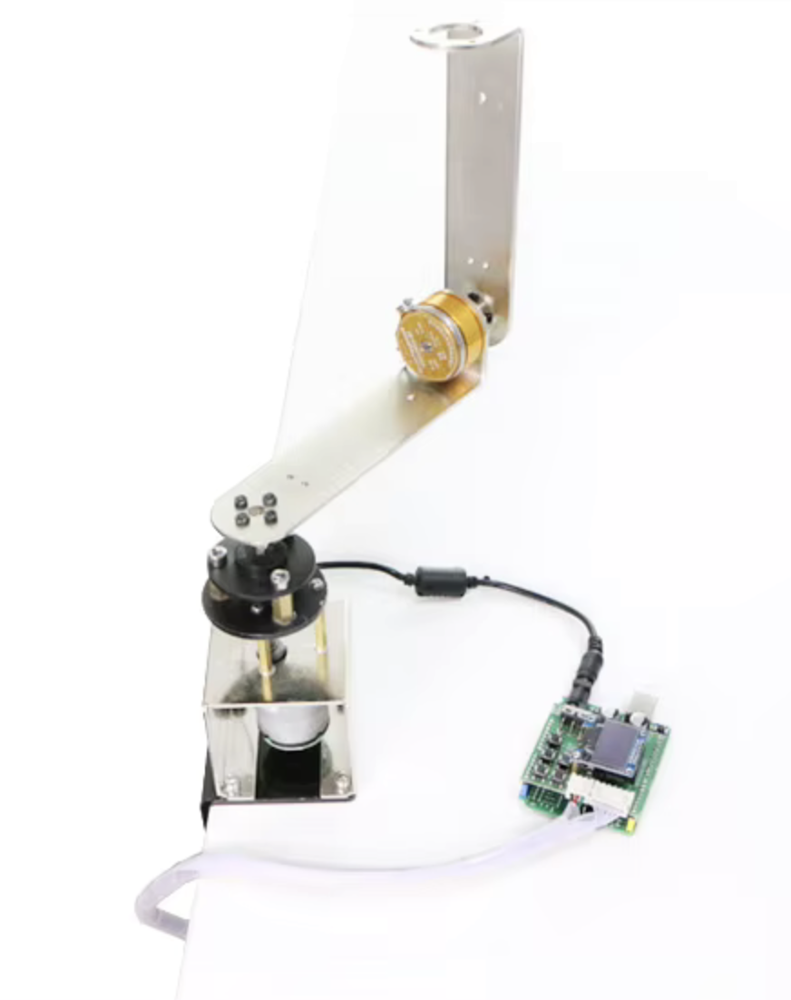

# Neural Network Agent for STM32 Inverted Pendulum Project

[](https://www.python.org/downloads/release/python-3111/)
[](LICENSE)
[](https://github.com/altaifeizi/rotary_pendulum_rl)
[](https://github.com/altaifeizi/rotary_pendulum_rl/commits/main)

**Repository for a custom neural network agent developed primarily in Python and C. This project supports the development and implementation of an improved agent for the control of a custom rotating inverted pendulum application.**

> **Note:** The actual application hardware (STM32 project) can be found [here](https://www.alibaba.com/product-detail/Custom-Rotating-inverted-pendulum-First-order_1600884506247.html?%20__detailProductImg=https%3A%2F%2Fs.alicdn.com%2F%40sc04%2Fkf%2FH25ae61ac257d466da2bfecf52b2413fak.jpg_200x200.jpg).

---

## Overview

- **Purpose:**  
  This repository contains code for training, parameter tuning, conversion, and implementation of a neural network agent intended for controlling an STM32-based inverted pendulum system. The current agent does not function on the real system yet—this repository is designed as a starting point for improvements and experiments.

- **Important Note:**  
  The Python-based model is **not** converted into TFLite. Instead, its functionality is reimplemented manually in C. The conversion is performed via custom scripts that export weights and biases as C arrays.

---

## Folder Structure

The project is organized into several directories, each with a dedicated purpose:

- **`training/` (Python):**  
  Contains scripts for training the neural network. The names of the scripts are self-explanatory, which should help you understand their individual purposes.

- **`conversion/` (Python):**  
  Provides conversion scripts that export neural network parameters (weights and biases) to C-style arrays.  
  - **Output:** The conversion scripts store these arrays in the `conversion/c_arrays/` directory, which **must be copied** to `neural_net/c_arrays` for the C implementation to function properly.

- **`tests/` (Python):**  
  This folder is for parameter determination tests. These scripts are meant to help fine-tune the model’s performance by adjusting parameters and testing different configurations.

- **`neural_net/` (C):**  
  Contains the C implementation of the neural network.  
  - **Build:** An included Makefile lets you compile the code into an executable for testing the inference on the neural network.  
  - **Configuration:** The inference initial conditions are set in `neural_net/src/main.c` and can be adjusted to suit your application.

- **`STM32_Project/` (C):**  
  Holds the STM32 project setup for use within STM32CubeIDE.  
  - **Setup:** Ensure to correctly configure the source locations and paths when importing into STM32CubeIDE.  
  - **Integration:** You must copy the generated C arrays to `STM32_Project/NN/c_arrays/`.  
  - **Inference:** The inference logic is implemented in `STM32_Project/Src/inference_controll.c`, which you can adapt as necessary.

---

## Getting Started

### Prerequisites

- **Python:** For training, conversion, and parameter testing.  
- **C Compiler & Make:** For building the neural network project in the `neural_net/` folder.  
- **STM32CubeIDE:** For setting up and testing the STM32 project.

### Installation & Setup

1. **Clone the repository:**

   ```bash
   git clone https://github.com/altaifeizi/rotary_pendulum_rl.git
   cd Agent
   ```

2. **Set Up Virtual Environments:**  
   **Important:** The repository excludes virtual environments (see `.gitignore`), so create a new virtual environment locally for your Python dependencies.

   ```bash
   python -m venv env
   source env/bin/activate  # On Windows use: env\Scripts\activate
   pip install -r requirements.txt
   ```

3. **STM32 Project Setup:**  
   - Open the project in **STM32CubeIDE**.
   - Adjust the source paths as required.
   - Copy the converted C arrays from `conversion/c_arrays/` (or wherever the output is generated) to `STM32_Project/NN/c_arrays/`.
   - Modify the inference controls in `STM32_Project/Src/inference_controll.c` as needed.

---

## Workflow

1. **Parameter Tuning (Python, `tests/` Folder)**  
   - Begin by adjusting parameters like friction, damping, or inertia. This step often requires experimentation with both the real system and the provided simulation scripts.  
   - The existing test scenarios can be used as-is or extended to explore different conditions. You can also create new test scripts to refine and validate parameters.

2. **Environment Updates & Agent Training**  
   - Once you have suitable parameters, add them into `training/rotary_pendulum_env.py`.  
   - Train the agent by running `training/train_pendulum_agent.py`.  
   - After training, you can test the trained agent with `training/test_agent_3D.py`.

3. **Model Conversion**  
   - Use `conversion/extract_params.py` **first** to extract the trained model’s weights and biases.  
   - Then run `conversion/convert2c.py` to transform them into C arrays.  
   - The resulting C arrays are stored in `conversion/c_arrays/`.

4. **C Implementation (neural_net/)**  
   - Copy the newly generated C arrays from `conversion/c_arrays/` into `neural_net/c_arrays/`.  
   - Optionally, run `make` in the `neural_net/` folder to compile and test an inference run in C. This lets you compare the C-based inference output with the original Python model.

5. **STM32 Integration**  
   - Copy the same C arrays into `STM32_Project/NN/c_arrays/`.  
   - Open the project in **STM32CubeIDE**, ensure the source paths are correct, and build the firmware.  
   - Flash it onto your STM32 board to test the agent on the real hardware.

6. **Iterative Improvement**  
   - Each stage of this workflow can be improved and repeated as needed:  
     - Fine-tune parameters in `tests/`  
     - Refine the environment or training scripts in `training/`  
     - Improve the C implementation in `neural_net/` or in `STM32_Project/`  
   - This iterative approach allows for continual enhancements and better performance.

---

## Contribution & Improvement

- The current agent is **experimental** and does not yet function on the actual hardware.  
- Contributions to improve the agent—whether by better training strategies, refined parameter tuning, or enhanced C implementation—are highly welcome.

Feel free to open an issue or submit a pull request with any improvements or ideas.

---

## License

This project is licensed under the MIT License – see the [LICENSE](LICENSE) file for details.

---

*This README was generated to help users understand, set up, and contribute to the Agent project. If further clarifications are needed, please open an issue on GitHub.*

---

Happy coding!

